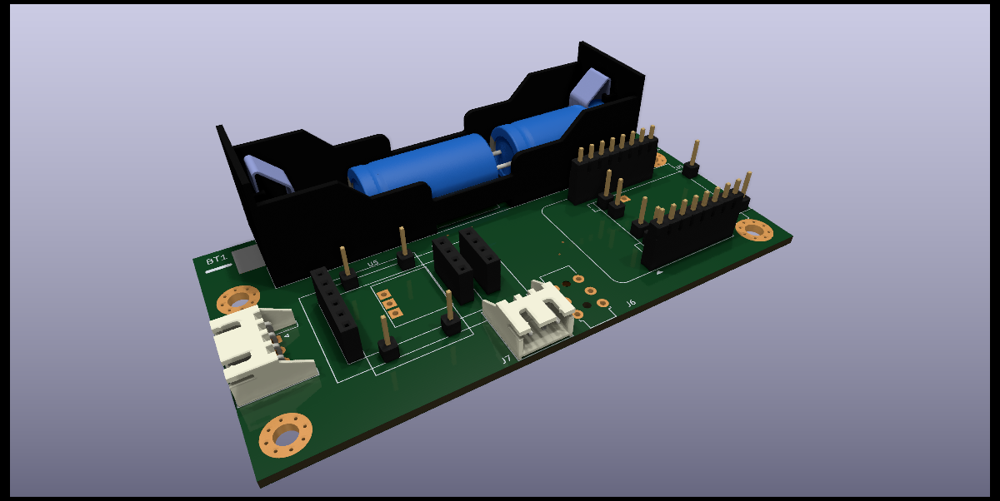
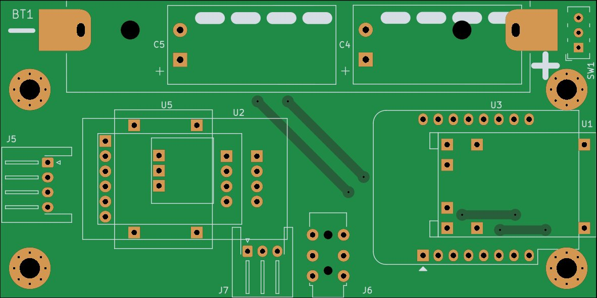
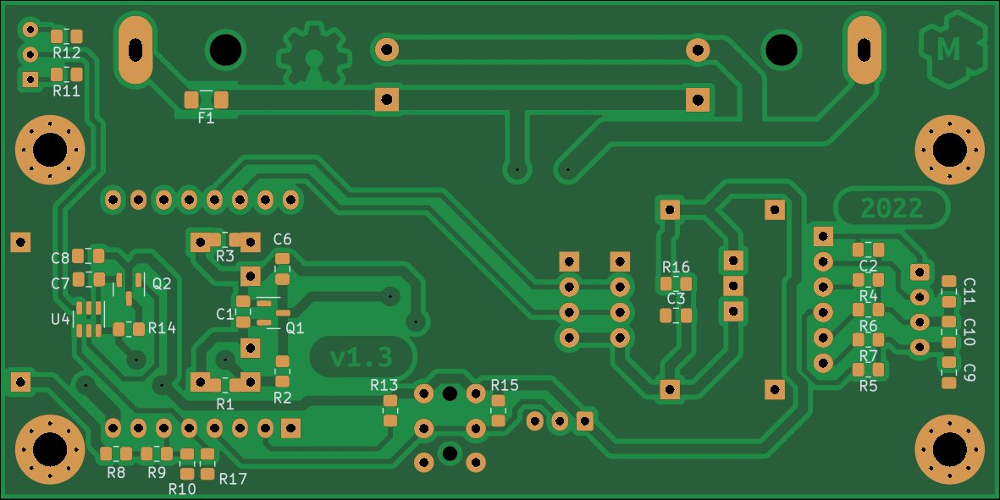
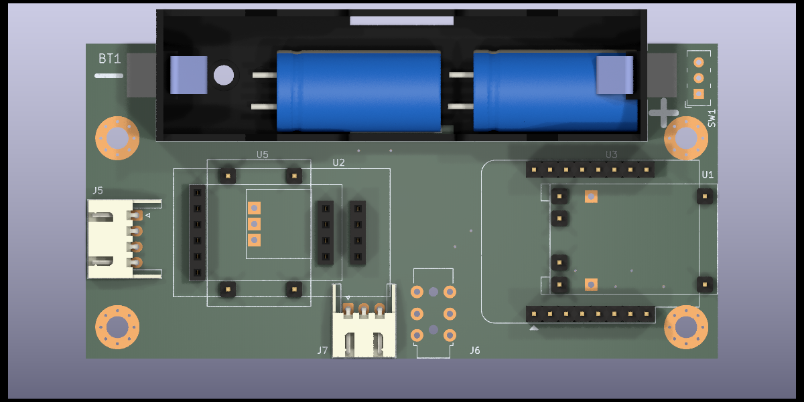

This is ESP8266 and HX711 based weight monitoring device.

* Designed from commonly available aliexpress modules.
* Supports multiple load cells.
* Can be populated with 18650 battery
* Can be operated in ultra low power mode

Dev NOTE: before commit, run `./kibot.sh` to regenerate documentation, bom, gerbers and other assets.

* [schematics.pdf](gen/schematics.pdf)
* [pcb.pdf with dimensions](gen/pcb.pdf)
* [pcb_bottom.pdf for toner transfer](gen/pcb_bottom.pdf)
* [ibom.html](gen/bom_ibom.html)
* [gerbers.zip](gen/gerbers/gerbers.zip)

## Normal operation

The circuit should be powered via a USB connector on the LiPo charger unless
battery support and low-power sleep is not used.

## Assembly and hardware configuration notes

### LiPo charger

Chargers(U1) with and without protection can be used. To use a charger without
protection that does not have separate power output pins - R1 needs to be
shorted out with a wire or zero ohms resistor.

For applications not requiring batteries whole LiPo charger section can be
omitted including components U1,Q1,BT1,F1,C1,C4,C5,C6. That requires that
the circuit be powered via a USB connector on the WeMos D1 mini module.

### Low-power sleep

A timer is equipped with selectable(SW1) wake-up settings(R11 and R12).

For applications that do not require a low-power sleep timer can be bypassed
by shorting out R14. Optionally components U3,C7,Q2,SW1,R11,R12 can be
omitted in assembly.

### Boost converter for ADC

Tests show that the circuit works down to about 2.7V without the need for
boosting voltage for ADC. Following that - the boost converter(U5) can be
omitted and R16 shorted out to bypass it.

### ADC configuration

To reduce noise on measurements capacitors(C9,C10,C11) on ADC input there
placed. As a side effect, they slow down reading settling time after weight change.
Removing these capacitors will give a fast reading but increase spread
by about 3 times.

Populating all of the R4,R5,R6,R7 links gives the ability to choose an ADC
amplifier and gain purely via software. What are the drawbacks of this
approach are unclear to me but there is an option to disconnect unused
amplifier by removing either R4 and R5 or R6 and R7 links.

## Software notes:

* keep D0 as input at all times for compatibility with older hardware (v1.0).

